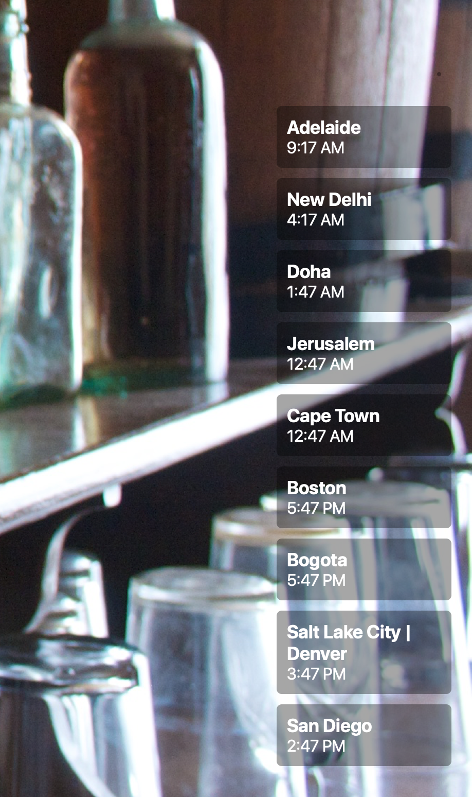

# City Times

An Übersicht widget that renders out a set of cities and their current time.

Edit the array of cities and timezones from line 4 in city-times.jsx. Cities are listed in the order you add them.

## Screenshot

